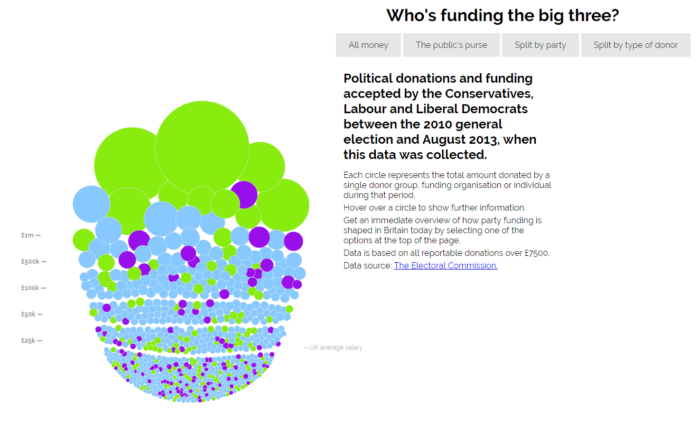
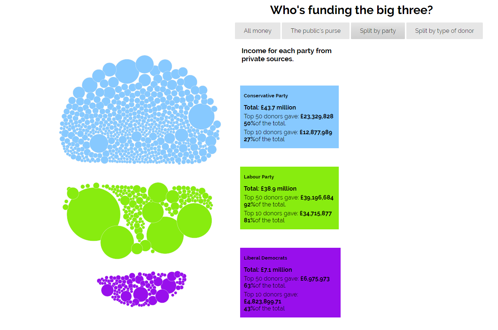
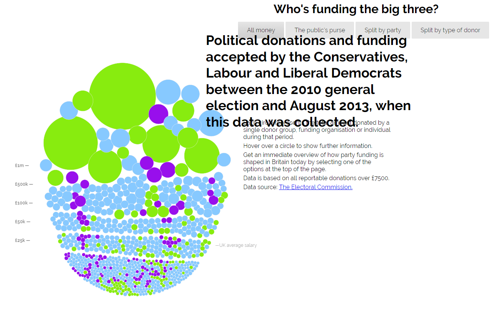

# Τελική Αναφορά
## Οπτικοποίηση δεδομένων χορηγιών (UK) 
## Μπαλαμπανίδης Δανιήλ Π2015147
### Σύνοψη: 

Repository link https://github.com/p15bala/D3js-uk-political-donations

Github pages link https://p15bala.github.io/D3js-uk-political-donations/full-viz

Σχετικό αποθετήριο github link https://github.com/ioniodi/D3js-uk-political-donations

### Εισαγωγή

Σκοπός της εργασίας ήταν να γνωρίσουμε τη βιβλιοθήκη D3 της javascript (οπτικοποίηση δεδομένων), χρησιμοποιώντας παράλληλα τις σελίδες github pages.Η εργασία βασίστηκε στο σχετικό [αποθετήριο του github](https://github.com/ioniodi/D3js-uk-political-donations) το οποίο [οπτικοποιεί](https://ioniodi.github.io/D3js-uk-political-donations/full-viz.html) δεδομένα δωρεών που έχουν γίνει σε πολιτικά κόμματα της Μεγάλης Βρετανίας.

### Διαδικασία ανάπτυξης 

Αρχικά,έγινε αλλαγή των χρωμάτων στις μπάλες με τα δεδομένα αλλα και στα αντίστοιχα 3 πεδία της ομαδοποίησης Split by party ενω προστέθηκε και ήχος στο πάτημα των κουμπιών ομαδοποίησης δεδομένων.Το τελευταίο πραγματοποιήθηκε δημιουργόντας μια νέα μεταβλητή `var bsound = new Audio("ButtonSound.mp3");` στο αρχείο [chart.js](https://github.com/p15bala/D3js-uk-political-donations/blob/master/chart.js) και βάζοντας τη γραμμή κώδικα `bsound.play();` σε κάθε περίπτωση της συνάρτησης `function transition(name)`.Στη συνέχεια έγινε ξανα τροποποίηση του αρχείου [chart.js](https://github.com/p15bala/D3js-uk-political-donations/blob/master/chart.js) και προστέθηκε η γραμμή 

`.on("click", function(d) { window.open("http://www.google.com/search?q=" + d.donor)});` 

δίνοντας τη δυνατότητα με το πάτημα μιας μπάλας,να γίνεται αναζήτηση πληροφοριών του αντίστοιχου δωρητή στο Google.

Στο τρίτο παραδοτέο της εργασίας μας ζητήθηκε να προσαρμόσουμε τις πληροφορίες της ιστοσελίδας στις ανάγκες των αναγνωστών με προβλήματα όρασης, αξιοποιώντας τις δυνατότητες της javascript για λειτουργίες μεγένθυνσης κειμένου και text-to-speech.Πρώτα προστέθηκε η γραμμή `var TextToSpeech = new SpeechSynthesisUtterance("The Donor is " + donor + " and he donated " + amount + " british pounds");
	window.speechSynthesis.speak(TextToSpeech);`  στο αρχείο [chart.js](https://github.com/p15bala/D3js-uk-political-donations/blob/master/chart.js) ώστε όταν το ποντίκι βρίσκεται μέσα στην μπαλα κάποιου δωρητή, να ακούγεται η ονομασία του δωρητή και το ποσό της δωρεάς.Στη συνέχεια έγιναν αλλαγές στο αρχείο [full-viz.html](https://github.com/p15bala/D3js-uk-political-donations/blob/master/full-viz.html) έτσι ώστε το ποντίκι να λειτουργεί ως μεγεθυντικός φακός όταν μεταφέρεται επάνω από λέξεις του κειμένου.
	
### Ενδεικτικές οθόνες 

Λειτουργία μεγεθυντικού φακού:

### Εργαλεία ανάπτυξης

Για την ανάπτυξη της εργασίας χρησιμοποιήθηκε η πλατφόρμα του github και η λειτουργία github pages.Έγινε χρήση των γλωσσών javascript, HTML και CSS.

### Συμπεράσματα 
Με την εργασία αυτη κατάφερα να εξοικειωθώ περισσότερο με το Github και ανακάλυψα τις δυνατότητες του Github Pages.Τέλος είχα την ευκαιρία να ασχοληθώ με τις γλώσσες javascript, HTML και CSS μαθαίνοντας καινούργια πράγματα για αυτες.
